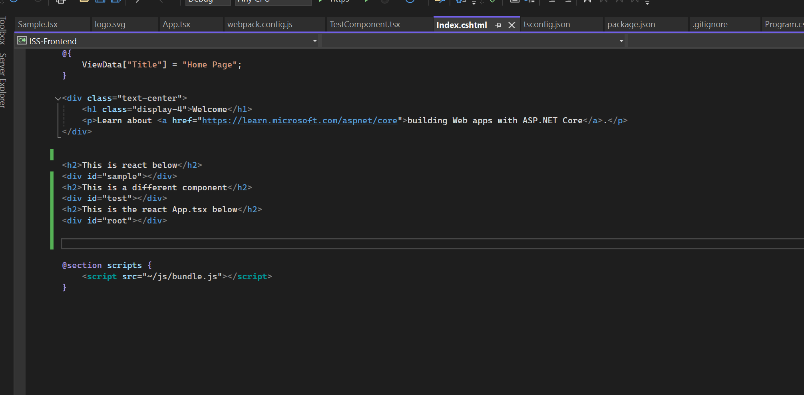
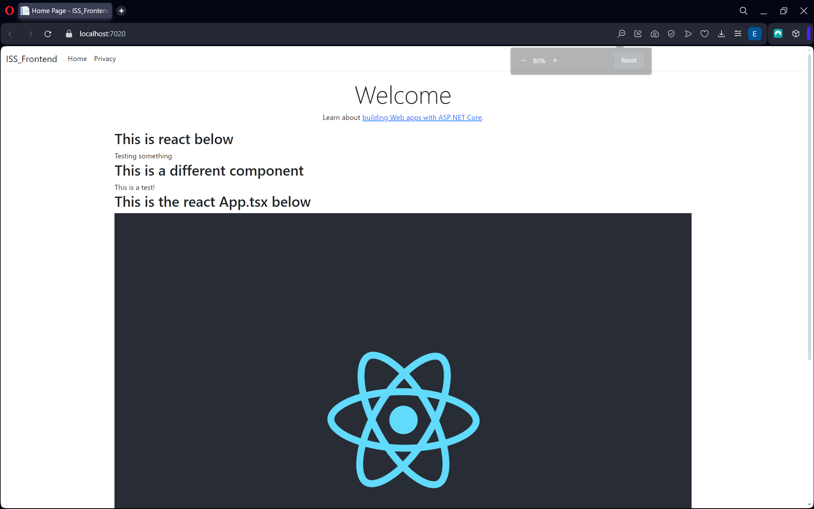

# UBB-SE-2024-Business

## To run the ASP.Net Core MVC application with React do this:
### In the `.cshtml` file, create a div with an id where you want to insert the react component

### In React, in  `App.tsx` you have to define where to render the components using this command: `ReactDOM.render(<YourComponent />, document.getElementById('id'))`

### And this is what you should see in the browser

### Before you press the `https` button on Visual Studio, you need to build the react project with `cd reactfe && npm run build`. There is an automated script that should do it every time you press `https`, but if you don't see changes in the website, run the `npm run build` command.